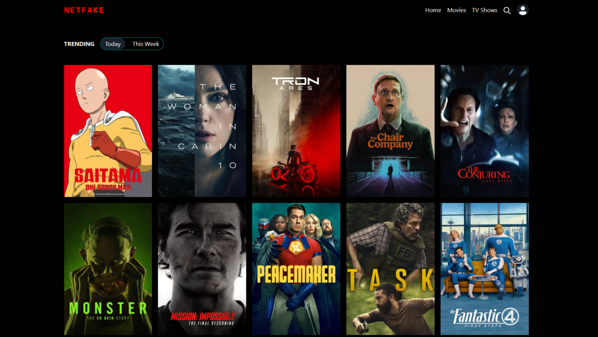

## 🎬 Movie Web - Movie Discovery and Watchlist Application
Movie Web is a modern web application built to explore the latest movies and TV shows. The project focuses on providing a minimalist, high-performance user interface, along with personalized features such as Watchlist management and user authentication.

## ✨ Key Features
* Content Discovery: View trending, top-rated, and upcoming movies and TV shows.

* Details Page: Displays detailed information about a title, including a synopsis, release date, rating score, and cast.

* Personalized Watchlist: Add and remove items from your private watchlist (login required).

* User Authentication: Secure login via Google/Firebase Authentication.

* Modern Interface: Uses Chakra UI for a beautiful, responsive, and easily customizable design.

## 🛠️ Technology Stack

This project is built on a Modern Web Stack:

* Frontend Framework: React

* Tooling/Bundler: Vite

* UI Library: Chakra UI

* Styling: CSS

* Data: The Movie Database (TMDB) API

* Backend/Database: Firebase Authentication & Firestore